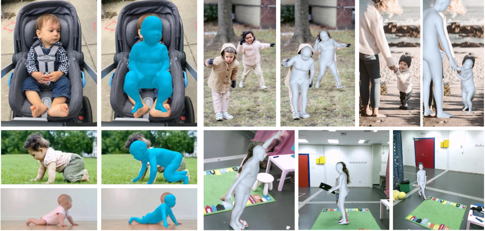

# Age-Inclusive 3D Human Mesh Recovery for Action-Preserving Data Anonymization

Official PyTorch implementation of the paper Age-Inclusive 3D Human Mesh Recovery for Action-Preserving Data Anonymization

[Project page](https://gioxatz.github.io/aionhmr/) | [ArXiv](https://arxiv.org/)




<!-- --- -->

<!-- ## 🔗 ArXiv Link

You can find the full paper on ArXiv here:

[Link to ArXiv Paper](https://arxiv.org/abs/xxxxxxxx)

**Cite this work:**

```bibtex
@article{YourLastNameYear,
  title={Full Title of Your Paper},
  author={Your Name(s) and Co-author(s)},
  journal={arXiv preprint arXiv:xxxxxxxx},
  year={Year}
} -->